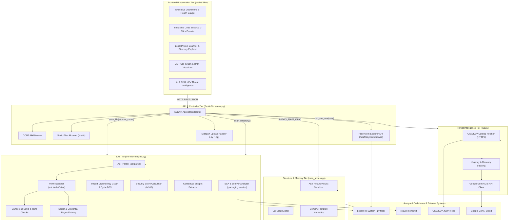
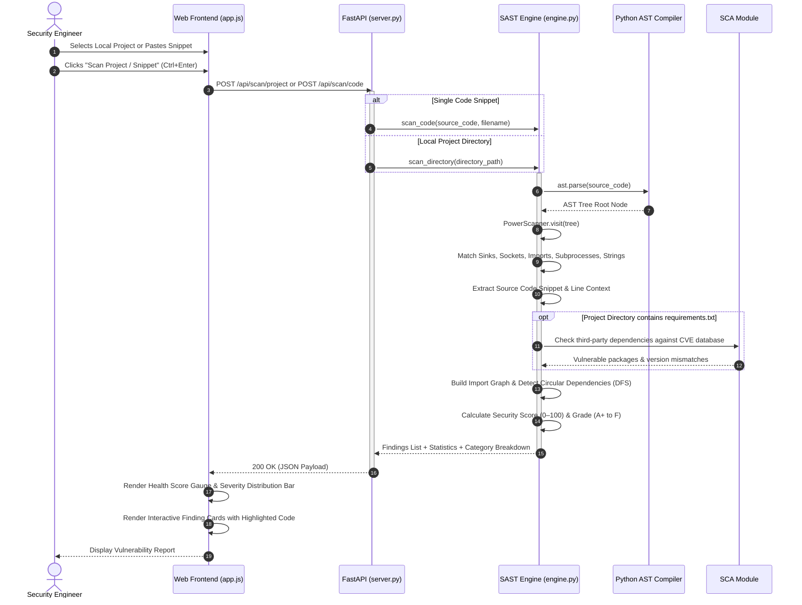
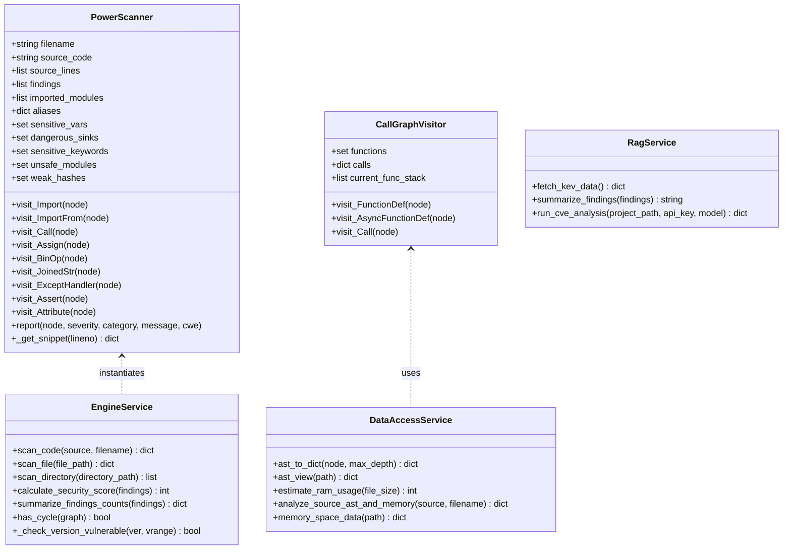

# Aegis SAST - System Architecture & Data Schema Specification

This document provides a comprehensive technical reference for the **Aegis SAST** platform, including component architecture diagrams, execution sequence flows, class relationships, and complete data schemas for all scanner inputs, outputs, and intelligence feeds.

---

## 1. High-Level System Architecture

The following diagram details the end-to-end architectural tiers of Aegis SAST:



---

## 2. Scan Execution Sequence Flow

The following sequence diagram illustrates the lifecycle of a scan request (from user action to AST analysis, finding contextualization, and final rendering):



---

## 3. Class & Component Architecture



---

## 4. Data Schemas & JSON Specifications

### 4.1 Vulnerability Finding Schema (`Finding`)

Represents an individual detected vulnerability or security violation.

```json
{
  "$schema": "http://json-schema.org/draft-07/schema#",
  "title": "Finding",
  "type": "object",
  "required": [
    "file",
    "line",
    "col",
    "severity",
    "category",
    "message",
    "cwe",
    "cwe_name",
    "remediation",
    "snippet"
  ],
  "properties": {
    "file": {
      "type": "string",
      "description": "Path or identifier of the affected source file"
    },
    "line": {
      "type": "integer",
      "description": "1-indexed line number where the issue originates"
    },
    "col": {
      "type": "integer",
      "description": "0-indexed column offset"
    },
    "end_line": {
      "type": "integer",
      "description": "1-indexed end line number"
    },
    "end_col": {
      "type": "integer",
      "description": "End column offset"
    },
    "severity": {
      "type": "string",
      "enum": ["CRITICAL", "HIGH", "MEDIUM", "LOW", "INFO"],
      "description": "Assigned severity level"
    },
    "category": {
      "type": "string",
      "description": "Vulnerability rule classification (e.g., Command Injection)"
    },
    "message": {
      "type": "string",
      "description": "Human-readable description of the security issue"
    },
    "cwe": {
      "type": "string",
      "description": "Common Weakness Enumeration ID (e.g., CWE-78)"
    },
    "cwe_name": {
      "type": "string",
      "description": "Official CWE taxonomy title"
    },
    "remediation": {
      "type": "string",
      "description": "Actionable instructions and best practices to remediate the vulnerability"
    },
    "snippet": {
      "$ref": "#/definitions/SnippetContext"
    }
  },
  "definitions": {
    "SnippetContext": {
      "type": "object",
      "required": ["start_line", "end_line", "target_line", "lines"],
      "properties": {
        "start_line": { "type": "integer" },
        "end_line": { "type": "integer" },
        "target_line": { "type": "integer" },
        "lines": {
          "type": "array",
          "items": {
            "type": "object",
            "required": ["line", "code", "is_target"],
            "properties": {
              "line": { "type": "integer" },
              "code": { "type": "string" },
              "is_target": { "type": "boolean" }
            }
          }
        }
      }
    }
  }
}
```

---

### 4.2 Local Project Scan Response Schema (`ProjectScanResult`)

Returned by `POST /api/scan/project` and `POST /analyze`.

```json
{
  "timestamp": "2026-10-08T08:15:00.000000",
  "scan_type": "project",
  "project_path": "C:\\Users\\DELL\\.gemini\\antigravity\\scratch\\SAST\\project_test",
  "total_findings": 5,
  "stats": {
    "CRITICAL": 0,
    "HIGH": 1,
    "MEDIUM": 1,
    "LOW": 3,
    "INFO": 0,
    "TOTAL": 5
  },
  "score": 68,
  "categories_breakdown": {
    "Hardcoded Secret": 1,
    "Insecure Debug Configuration": 1,
    "Sensitive Access": 3
  },
  "files_with_issues_count": 3,
  "findings": [
    {
      "file": "C:\\Users\\DELL\\.gemini\\antigravity\\scratch\\SAST\\project_test\\mysite\\mysite\\settings.py",
      "line": 22,
      "col": 0,
      "end_line": 22,
      "end_col": 32,
      "severity": "HIGH",
      "category": "Hardcoded Secret",
      "message": "Potential sensitive data in variable 'SECRET_KEY'.",
      "cwe": "CWE-798",
      "cwe_name": "Use of Hard-coded Credentials",
      "remediation": "Store secrets, passwords, and API keys in environment variables or a secure vault.",
      "snippet": {
        "start_line": 20,
        "end_line": 24,
        "target_line": 22,
        "lines": [
          { "line": 20, "code": "# SECURITY WARNING: keep the secret key used in production secret!", "is_target": false },
          { "line": 21, "code": "", "is_target": false },
          { "line": 22, "code": "SECRET_KEY = 'django-insecure-test-key'", "is_target": true },
          { "line": 23, "code": "", "is_target": false },
          { "line": 24, "code": "# SECURITY WARNING: don't run with debug turned on in production!", "is_target": false }
        ]
      }
    }
  ]
}
```

---

### 4.3 Single File & Code Snippet Scan Response Schema (`SingleFileScanResult`)

Returned by `POST /api/scan/file` and `POST /api/scan/code`.

```json
{
  "timestamp": "2026-10-08T08:15:00.000000",
  "scan_type": "code_snippet",
  "filename": "snippet.py",
  "line_count": 8,
  "total_findings": 2,
  "stats": {
    "CRITICAL": 1,
    "HIGH": 1,
    "MEDIUM": 0,
    "LOW": 0,
    "INFO": 0,
    "TOTAL": 2
  },
  "score": 60,
  "findings": [
    {
      "file": "snippet.py",
      "line": 6,
      "col": 4,
      "end_line": 6,
      "end_col": 52,
      "severity": "CRITICAL",
      "category": "Command Injection",
      "message": "subprocess.run with shell=True enables shell injection.",
      "cwe": "CWE-78",
      "cwe_name": "Improper Neutralization of Special Elements used in an OS Command",
      "remediation": "Do not pass shell=True or concatenate user input into shell commands. Pass argument lists to subprocess without shell=True.",
      "snippet": {
        "start_line": 4,
        "end_line": 8,
        "target_line": 6,
        "lines": [
          { "line": 4, "code": "def run_cmd(user_arg):", "is_target": false },
          { "line": 5, "code": "    # Vulnerable", "is_target": false },
          { "line": 6, "code": "    subprocess.run(\"ls \" + user_arg, shell=True)", "is_target": true },
          { "line": 7, "code": "", "is_target": false },
          { "line": 8, "code": "", "is_target": false }
        ]
      }
    }
  ],
  "imported_modules": ["subprocess"]
}
```

---

### 4.4 AST & Memory Inspection Schema (`ASTMemoryResult`)

Returned by `POST /api/data_access`.

```json
{
  "timestamp": "2026-10-08T08:15:00.000000",
  "path": "C:\\Users\\DELL\\.gemini\\antigravity\\scratch\\SAST\\project_test",
  "memory_space_data": {
    "C:\\Users\\DELL\\...\\manage.py": {
      "filename": "manage.py",
      "file_size_bytes": 684,
      "estimated_ram_bytes": 50000,
      "call_graph": {
        "main": ["execute_from_command_line"]
      },
      "recursive_functions": [],
      "classes": [],
      "functions": ["main"]
    },
    "__summary__": {
      "total_py_files_scanned": 15,
      "total_size_bytes": 14210,
      "total_size_human": "0.01 MB",
      "total_estimated_ram_bytes": 750000,
      "total_estimated_ram_human": "0.75 MB (rough estimate)"
    }
  },
  "ast_view": {
    "note": "AST view skipped (enable include_ast=true)"
  }
}
```

---

### 4.5 AI Threat Intelligence Correlation Schema (`RAGThreatResult`)

Returned by `POST /api/rag_cve`.

```json
{
  "success": true,
  "timestamp": "2026-10-08T08:15:00.000000",
  "project_path": "./project_test",
  "model_used": "gemini-2.5-flash",
  "scanner_issues_count": 5,
  "relevant_cves_count": 14,
  "total_kev_catalog_size": 1340,
  "analysis": "### Executive Threat Correlation\n\n- **Immediate Priority**: Hardcoded SECRET_KEY allows session forging...\n- **Exploitation Threat**: Correlated with recent command execution campaigns...",
  "scanner_summary": "Total issues found: 5\nSeverity breakdown:\n  • HIGH: 1\n  • MEDIUM: 1\n  • LOW: 3",
  "relevant_cves_sample": [
    {
      "cve": "CVE-2025-66418",
      "vendor": "Urllib3 Project",
      "product": "urllib3",
      "name": "Decompression Chain DoS",
      "added": "2025-08-10",
      "due": "2025-09-01",
      "action": "Apply vendor updates",
      "ransomware": "Known"
    }
  ]
}
```

---

## 5. Security Rules & Taxonomy Matrix

| Category | Default Severity | CWE ID | Description | Remediation |
| :--- | :--- | :--- | :--- | :--- |
| **Command Injection** | `CRITICAL` / `HIGH` | `CWE-78` | Dynamic execution via `subprocess(shell=True)`, `os.system`, `os.popen` | Pass argument lists without `shell=True` |
| **Potential SQL Injection** | `HIGH` | `CWE-89` | Concatenation or f-string interpolation into SQL statement strings | Use parameterized queries or ORM models |
| **Hardcoded Secret** | `HIGH` | `CWE-798` | Hardcoded credential literals assigned to sensitive token variables | Use environment variables or vault services |
| **Insecure Deserialization** | `HIGH` | `CWE-502` | Untrusted deserialization via `pickle.loads` or `yaml.load` | Use safe formats (`json`, `yaml.safe_load`) |
| **Insecure Temp File** | `HIGH` | `CWE-377` | Insecure file creation via `tempfile.mktemp()` susceptible to TOCTOU race | Use `tempfile.NamedTemporaryFile()` |
| **Dangerous Sink** | `HIGH` | `CWE-95` | Direct code execution via `eval()`, `exec()`, or `compile()` | Avoid dynamic evaluation; use `ast.literal_eval` |
| **Weak Cryptography** | `MEDIUM` | `CWE-327` | Broken hash algorithms (`md5`, `sha1`) | Upgrade to SHA-256/SHA-3 or bcrypt/Argon2 |
| **Insecure Debug Config** | `MEDIUM` | `CWE-489` | `DEBUG = True` enabled in configuration | Disable debug flags in production environments |
| **XML Vulnerability** | `MEDIUM` | `CWE-611` | Standard XML parsing vulnerable to XXE injection | Use `defusedxml` |
| **Insecure Import** | `MEDIUM` | `CWE-676` | Dangerous modules (`telnetlib`, `cPickle`, `imp`, `shelve`) | Replace with modern secure alternatives |
| **Circular Import** | `MEDIUM` | `CWE-400` | Cyclical import graph detected via DFS cycle detection | Refactor dependencies or use local imports |
| **Vulnerable Dependency** | `HIGH` | `CWE-1395` | Outdated package in `requirements.txt` matching known CVEs | Upgrade affected package |
| **Sensitive Access** | `LOW` | `CWE-200` | Unrestricted read access to `os.environ` | Validate and sanitize environment variable leaks |
| **Debug Statement** | `LOW` | `CWE-489` | `assert` statements used for runtime enforcement | Replace with explicit conditional exception raises |
| **Poor Error Handling** | `LOW` | `CWE-391` | Bare `except:` clauses silencing unexpected exceptions | Catch specific exception types |
